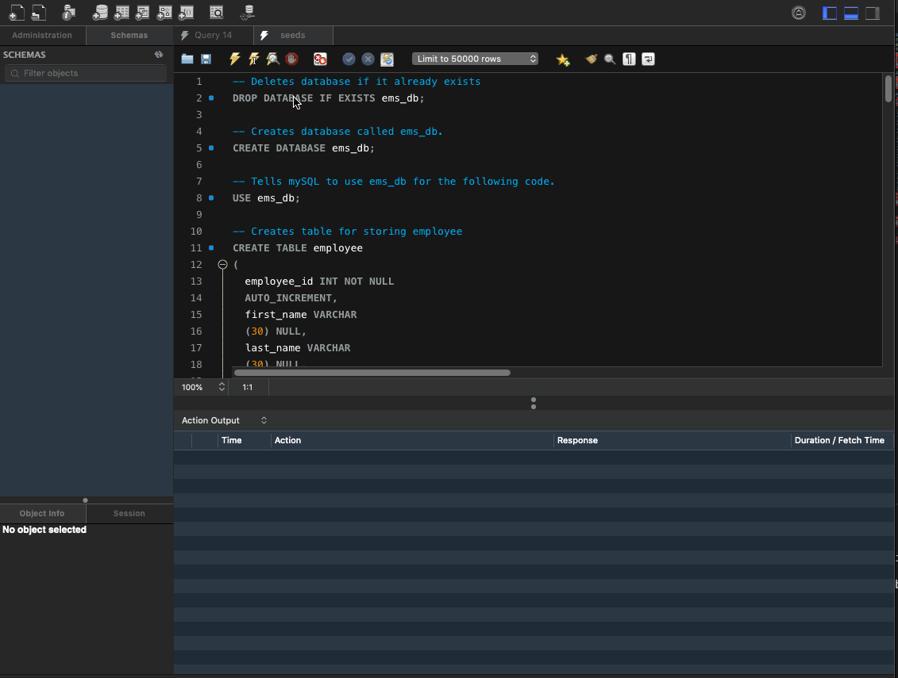
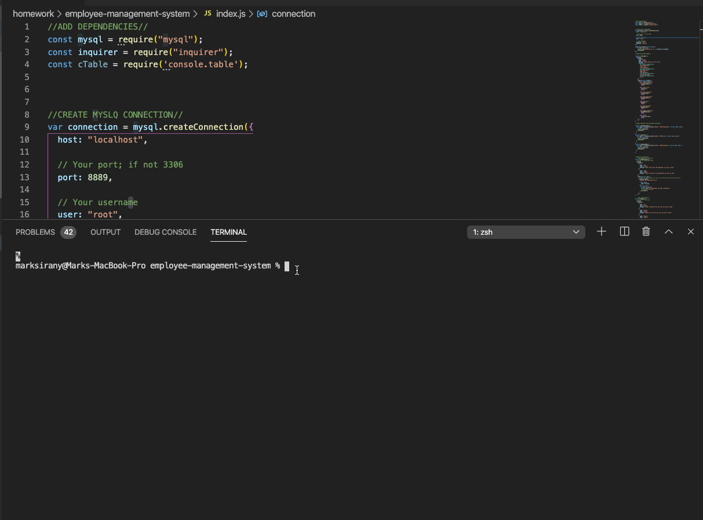

# employee-management-system
In this homework assignment, your challenge is to architect and build a solution for managing a company's employees using node, inquirer, and MySQL.

# GIF of my seeds SQL file running:

# GIF of my index.js file running:

